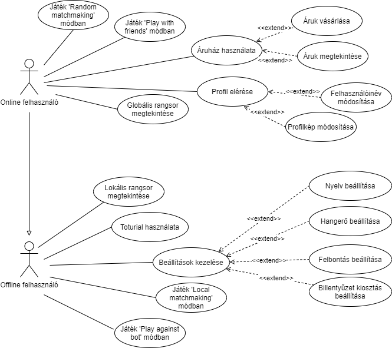
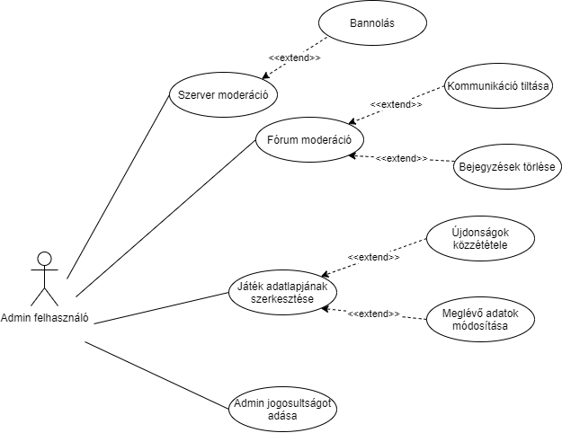

# H3 - SRS dokumentum

## Gyakorlatvezető: Krizsán Zoltán

## FröccsÖntők - Csapattagok
Név|Neptunkód|Email|Feladat
:-----:|:-----:|:-----:|:-----:
Juhász Ákos|F58KQ8|juhaszakos7@gmail.com|játékfejlesztő, grafikus
Szűcs Attila|DJA75O|sz.attila0317@gmail.com|játékfejlesztő, dokumentáció
Molnár Balázs|KFIXBJ|molbazsa@gmail.com|játékfejlesztő, dokumentáció
Takács Bálint|P2GNFT|takacsb39@gmail.com|játékfejlesztő, prezentáló
Slyízs István Gábor|HVM06X|slyizsistvangabor@gmail.com|csapatkapitány, játékfejlesztő

## 1. Bevezetés

A projektünk célja a Fröccs nevű kártyajáték megalkotása digitális formában.

A játékmenet a társasjáték szabályait fogja követni, a játékosok különböző karaktereket magukra öltve vesznek majd részt a játékban. A játékosok rendelkezni fognak játékosnévvel, eredményeiket szintjük és egy rangsor fogja nyilvátartani. Játékunk a több játékos (más felhasználók elleni) és az egy játékos (botok elleni) játékmódot is támogatni fogja.

Az egy játékos módhoz nem lesz szükség Internet-kapcsolatra, a több játékos módhoz sem feltétlenül kell majd (ez lesz a lokális multiplayer mód).

Ez a dokumentum a fejlesztendő játékprogram részletes szoftverspecifikációját tartalmazza.

## 2. Áttekintés

### 2.1 A termék környezete és elhelyezkedése

Kinek készült (melyik / milyen szervezetnek): A majd elkészült Fröccs játék implementációját elsősorban a legjelentősebb és legelterjedtebb online játékáruház keretein belül, a Steam online áruházban tervezzük terjeszteni. Az itteni terjesztés széleskörben képes lesz eljuttatni a kész terméket a felhasználókhoz világszerte.

Ki fogja használni: Az általunk priorizált célközönség a 14 – 40–es korosztály lenne. Ez a célközönség értékelhetné legjobban a játék humorát és annak egyszerű, de mégis fondorlatos játékélményét. Ebben a korcsoportba beletartozik a 18 – 24 éves korosztály is, ami sok kutatás szerint magába foglalja a videó játékokkal foglalkozó emberek legnagyobb részét. A játék alapvető témája és az alkohol gyakori említése miatt a legfiatalabb korosztálynak nem feltétlenül lesz megfelelő a Fröccs játék használata.

Milyen alkalmazás kategóriába tartozik (pl. fejlesztőeszköz, vállalati információs rendszer, stb.): Az alkalmazás a játékszoftver kategóriában helyezkedik el. A játékszoftverek piaca folyamatosan növekszik, és rengeteg lehetőséget illetve magas bevételt hordoz magával. 2020-ban a komplett videójáték-piac értékét több, mint 1.59 billió amerikai dollárra becsülték. A Fröccsöntők csapata ezt a piacot tervezi megcélozni az új játékszoftver létrehozásával.

Mi az alapvető haszna: Az alkalmazást igénybevevő felhasználók számára nyugtató, relaxációs időtöltésként használható. Illetve a játék egy plusz kihívást, tanulási lehetőséget szolgáltat, annak fejlett stratégiai játékélményével. A program a szociális készségek fejlődésében is segítheti a felhasználót, hiszen a játék elengedhetetlen része a többi játékossal való érintkezés és tárgyalás.

Milyen alternatívák lehetnek a fejlesztésen kívül (meglevő más rendszer, másféle megoldás, ezek előnyei, hátrányai): Alapvető terjesztési célként a Steam online áruházat céloztuk meg. Ezáltal is elkötelezve a projektet az asztali számítógépeken való használat mellett. Csoportunk tisztában van a Google Play (Android) és az App Store (IOS) alapú terjesztés lehetőségével is. Ezeknek a felületeknek is jelentős vásárlói és követői közössége van, de arra jutottunk, hogy az alkalmazás lehető legjobb játékélményhez elengedhetetlen az asztali számítógépek környezete. A Fröccs játék első kiadását követően, a játék deputálásáról bejövő információk alapján még az imént említett platformokra való kiterjesztése sem lehetetlen.

Miben különbözik alapvetően az elkészült termék az alternatíváktól: A Fröccshöz hasonlóan rengeteg online kártya és társasjáték létezik a világon. Gondolhatunk itt Hearthstonera, Yu-gi-ohra vagy az egyszerűbb Uno virtuális változatára is. A Hearthstonehoz hasonló alkalmazások a játékélmény mellett a kártyák megszerzésének is nagy szerepet tulajdonítanak. Ezt a játékban eltöltött idővel vagy gyakrabban online tranzakciókkal próbálják implementálni. A fröccs játéknál viszont fontosnak tartjuk, hogy a felhasználó az alap játék minden részéhez alapból hozzáférjenek, ezáltal már a kezdetektől teljes játékélményben legyen része a felhasználóknak. Illetve a hasonló alternatíváknál gyakori az egy az egy elleni játékmenet használata, viszont mi megpróbáljuk az eredeti társasjátékot minél pontosabban előhozni az implementáció során. Ezáltal egy játékmenet akár 3 – 6 játékos számára is elérhető lesz egyszerre.

### 2.2 Legfontosabb funkciók

#### Bejelentkezési képernyő:
Ha a felhasználó rendelkezik Internet-kapcsolattal, akkor meg fog jelenni a bejelentkezési képernyő, ahol beléphet játékos profiljába. Amennyiben első használatkor vagy kijelentkezés után nincs kapcsolat, az egy játékos és lokális multiplayer módok elérhetőek lesznek bejelentkezés nélkül. Ha egy játékos be volt jelentkezve, akkor a legutoljára szinkronizált adatok (pl. szint) elérhetőek lesznek kapcsolat nélkül is, ezenkívül az előbb említett két játékmód is használható lesz.

#### Menü:
Bejelentkezés után a menüt fogja látni a felhasználó.

A menü a következő menüpontokból fog állni:
- Játékmódok, azaz:
    - Local Matchmaking
    - Play with Friends
    - Random Matchmaking
    - Play against Bot
- Beállítások
- Profil
- Áruház

A Local Matchmaking segítségével lokális multiplayer módban játszhatunk, a játékosok ilyenkor külön billentyűkiosztást kapnak és egy számítógépen játszhatnak egymás ellen. A Play with Friends menüpontot választva a Steam-es barátainkkal indíthatunk játékot. A Random Matchmaking más játékosokkal sorsol össze minket. Az egy játékos mód a Play against Bot menüpont segítségével lesz elérhető.

A Profil menüpontban megtekinthetőek lesznek a bejelentkezett játékosok. Látható lesz szintjük, továbbá online módban az online ranglista, offline módban csak a 15 rekordtartó felhasználó eredményét tároló lokális ranglista.

Az Áruházban a partik után szerzett virtuális zsetonokért tudunk majd vizuális kiegészítőket venni a játékhoz.

#### Beállítások:

A következő beállításokat lesz lehetősége módosítani a játékosoknak:
- Nyelv
- Hangerő
- Felbontás
- Billenytűkiosztás

#### Játékablak:

A játékablakban fog megjelenni a virtuális asztal, illetve a játékosok paklijai, maguk elé helyezett vagy kijátszott lapjaik.

A játékmódtól függően a játékablak a következőképpen változik:
- Ha több játékos módban játszunk akkor a játékosok nevei is megjelennek. Online multiplayer esetén a Steam fiókhoz tartozó nevek, lokális multiplayer esetén a bejelentkezett felhasználó és a megadott játékosok nevei jelennek meg.
- Egy játékos mód esetén a bot(ok) fogják kezelni az ellenfél játékosok lapjait.

### 2.3 Felhasználók

A felhasználók Steam-fiókkal rendelkező játékosok lesznek, ez alól kivétel, ha első indításkor vagy kijelentkezés után offline módban játszanak, ekkor nem Steam-fiókkal hanem a beírt nevekkel lesznek azonosítva a játékosok.

A jelenlegi időszakban várhatóan növekedni fog a felhasználók száma, ha a COVID-19 járvány újabb hulláma miatt az emberek újra home office-ba és karantánba kényszerülnek. Várhatóan egy felhasználó egyszerre nagyjából 1-2 óráig fogja használni a szoftvert, azonban ez az idő változhat különböző körülmények hatására (pl.: Ha több fős tarsaságban használják a szoftvert és így egymás ellen több partit is lejátszanak a felhasználók). Különböző frissítésekkel arra törekszünk majd, hogy a felhasználók hosszútávon is minél tovább használják a szoftvert.

### 2.4 Feltételezések és függőségek

A több játékos módhoz Internet-kapcsolatra lesz szükség, hogy elérhető legyen a többi játékos, ez alól kivételt képez a lokális multiplayer mód. Mivel egy kártyajátékról van szó, rövidebb ideig nem okoz problémát a kapcsolat hiánya. Ha egy kimaradás után visszatér a hálózati kapcsolat, a többi játékos lépéseit könnyedén szinkronizálhatjuk az újra csatlakozott klienssel. Ha egy játékosnak egy adott pillanatban nincs kapcsolata, minden játékos felé egy ikonnal lesz jelezve. Ha a kapcsolat 45 másodperc alatt nem jön újra létre, akkor a többi játékosnak egy felugró ablakban felajánljuk, hogy befejezzék a játékot, vagy tovább várakozzanak. A játékosok természetesen a 45 másodperc alatt is kiléphetnek a menü segítségével.

A játékosnév és fiók létrehozása lehetséges lesz email-cím segítségével, illetve Google- vagy Facebook-fiókkal. Ennek működése függ a Google és Facebook szervereinek elérhetőségétől, ezért ezekre csak regisztrációkor lesz szükség, a regisztrációt követően egy játékosnév és jelszó párossal mindig be lehet majd jelentkezni, feltéve, hogy a mi szerverünk elérhető.

A játékosok kapcsolódása egy szerver segítségével lesz megvalósítva, ennek megoldása egy szerver-bérlő szolgáltatás segítségével történne (pl. linode, AWS, Microsoft Azure). A játékunk így függ a szolgáltató elérhetőségétől.

Hogy minden játékos számára elérhetőek legyenek az esetleg utólag hozzáadott funkciók, illetve javítások, a több játékos módban feltételezzük, hogy minden játékos a legfrisseb verzióval rendelkezik. Ezt a játék minden induláskor ellenőrizni fogja, amennyiben a játékos rendelkezik Internet-kapcsolattal.

Feltételezzük, hogy a játékos rendelkezik a minimális hardverkövetelményekkel. Abban az esetben, ha nincs inkompatibilitás, csak lassabb hardverrel rendelkezik a felhasználó, a játék megpróbál majd elindulni, de a megfelelő játékélményt nem tudjuk garantálni.

A játékszabályok ismeretét is feltételezzük, a szabályok elérhetőek lesznek a menüben.

## 3. A rendszer funkciói
A következő pontokban a játék mindenki számára elérhető funkcióit mutatom be.

#### Steamen elérhető funkciók: 
-	Játék indítása: A gomb megnyomásával a játék automatikusan elindul vagy ha frissítés érhető el, akkor első sorban feltelepülnek a frissítések és a játék ezután indul el.
-	Fórum: Itt érhető el a játék hivatalos fórum felülete ahol a játékosok bejegyzéseket tehetnek közzé adott témák. A fórum a játékos közösség létrejöttét szolgálja majd és segíti majd a kapcsolattartást a játékosok és a fejlesztők között.
-	A játék profilja: Itt tálható a játék leírása különböző tulajdonságokkal és a rendszer követelményekkel együtt.
-	Barátok: Egy listában láthatjuk azokat a Steam-es barátainkat akik szintén játszanak a játékkal, és a nevük mellet láthatjuk hogy éppen aktívak-e vagy sem.
-	Jutalmak: Itt tálálhatjuk a játékban elért eredmények után megszerzett jutalmainkat, kitüntetéseinket.
-	Újdonságok: A készítők ezen a felületen tudják közzétenni a játékba érkező újdonságokat változásokat és további aktualitásokat.

#### A játékban elérhető funkciók:
-	Bejelentkezés: Steam-en keresztül a Steam fiókunkkal.
-	Játék Bot ellen: Elindul a játékmenet az általunk kiválasztott számú és nehézségi fokozatú botok ellen. A játékban elért eredményeinkért jutalompontokat és különböző ajándékokat kaphatunk
-	Lokális parti: Ezen játékmód elindításakor mindegyik játékosnak egyedi nevet kell megadnia, ami alapján a játék meg tudja őket különböztetni. Egyszerre 3-6 személy játszhat. Ezek után indul el a játékmenet, azonban itt a játékosok nem kapnak jutalmakat, csakis pontokat az eredményeik után, amelyek alapján egy rangsort állít fel a játék a partiban résztvevő játékosokról.
-	Online parti: A parti létrehozásakor először lehetőségünk van megadni, hogy hány embert szeretnénk meghívni a partiba. A Steam-es barátainkat is meg tudjuk hívni a partiba ezután elindíthatjuk a meccskeresést amely addig fut majd ameddig a rendszer nem tál annyi játékost amennyi játékos még szükséges ahhoz hogy meglegyen a meccskeresés elején beállított létszám. A játékmenet a hagyományos és az itt elért eredményeinkért is kapunk jutalompontokat valamint ajándékokat.
-	Grafikai beállítások: A beállítások menü ponton belül lehetőségünk van a játék megjelenítésén változtatni. Itt beállíthatjuk a felbontást, a képernyőmódot (ablakban/teljesképernyős), a grafika minőségét (alacsony/közepes/magas), valamint beállíthatjuk a képfrissítést is (30 Fps/60 Fps/ Korlátlan).
-	Nyelvi beállítások: Itt megváltoztathatjuk a játékban használt nyelvet (Magyar/Angol/Német).
-	Hang beállítások: A játék több fajta hangeffektet is tartalmaz majd, itt lehetőségünk lesz majd ezek hangerejét módosítani. Beállíthatjuk  majd a játék fő hangerejét, a háttérben játszódó zenék hangerejét, valamint a játékmenet közbeni hangeffektek hangerejét.
-	Irányítások: Ebben a menüpontban személyre szabhatjuk a játék irányítását. Változtathatunk a billentyűkiosztáson és az egér működését is beállíthatjuk. 
-	Tutorial: Egy próba játékmenet amelyben a felhasználó botok ellen játszik és játék közben üzeneteket kap segítség képpen. Ennek a módnak a célja, a játékmenet teljes bemutatása és segítség nyújtás a játékhoz szükséges tudás elsajátításában. Ennek befejeztével a játékos egy kezdő bónuszt kap.
-	Rangsor: A felhasználókat a játékban elért eredményeik alapján rangsorolják. Ez a rangsor ebben a menüpontban tekinthető meg.

A játékot használó személyeket alapvetően két csoportra oszthatók. Ezek a felhasználók (játékosok), akik program funkcióinak az élvezői, valamint vannak az adminok akiknek jogosultságuk van a szerver moderációjára is.

#### Felhasználó (játékos) számára elérhető funkciók:
-	A fent említett Steam-es és játékbeli funkciók teljes körű használata.
-	Regisztráció a Steam rendszerébe. Ezután lehetséges a játék aktiválása és használata.
-	Bejelentkezés : A regisztrált adatainkat megadva tudunk belépni a Steam rendszerébe ahonnan elérjük a játékot.
-	A játék számítógépen elfoglalt helyének pontos megadása a telepítéskor.
-	Adatok módosítása: A Steam-en belül a felhasználóknak lehetőségük van a profiljuk adatainak a módosítására (Pl.: jelszó, felhasználónév, e-mail cím).
-	A fórum megtekintése és bejegyzés írása.
-	Virtuális zsetonok gyűjtése: Minden parti után, különböző mérföldkövek elérése után és a napi bejelentkezések után virtuális zsetonokat kapunk amit a fiókunkon gyűjthetünk, természetesen ezt a program számon tartja.
-	Áruház használata: Az áruházban a virtuális zsetonjainkat szabadon fel tudjuk használni és vizuális kiegészítőket tudunk vásárolni.
-	Barátok hozzáadása: Steam felhasználókat tudunk hozzáadni a barát listánkhoz a felhasználónevük alapján.
-	Jelentés: A játékosok, ha a parti folyamán esetleg csalással, gyűlöletbeszéddel vagy olyan játékossal találkoznak akik mások játékát rontják el akkor azt jelenthetik és ennek a jogosságát az Admin fogja kivizsgálni.

#### Admin számára elérhető funkciók:
-	Az Admin számára minden funkció elérhető ami a játékos számára is!
-	Szerver moderáció: Az Admin felelős a szerver stabilitásáért és karbantartásáért, a bejelentkezések kezeléséért, a szoftver frissítéséért, a hibák kijavításáért, adatbázis szinkronizálásáért és a felhasználói jogosultságok beállításáért.
-	Fórum moderáció: Az Admin lesz a felelős a teljes fórumért. Ő hozhat létre új témákat de el is távolíthatja őket. Az Admin dolga az üzenetek moderálása, tehát az oda nem illő, a közösségi irányelvekkel szembemenő bejegyzéseket is eltávolíthatja és adott esetben a bejegyzés íróját ki is tilthatja a fórumról. A fórumban a fejlesztők felé érkező üzenetekre az Admin válaszol és az itt jelentett hibák kijavításáért is az Admin felel majd
-	Bannolás: A beérkező jelentéseket az Admin vizsgálja ki, és ha a vádak igaznak bizonyulnak, akkor büntetést szabhat ki feléjük. A jelentett játékos kitilthatja külön csak az online játékmódokból, de a teljes játékból is. Ilyenkor a jelentett játékos nem tud online partit létrehozni vagy már a játékba se tud belépni, ezt egy üzenet formájában jelezzük feléjük. Ezek a büntetések egy adott ideig vannak hatályban, de súlyos vagy rendszeresen visszaeső eseteknél a tiltás végleges is lehet.
-	Az Adminnak áll jogában a játék adatlapjának a szerkesztése és az újdonságok folyamatos közzététele.
-	Egyedül az Admin ruházhat fel admin jogosultsággal más felhasználókat.

## 3.1 Offline felhasználó számára elérhető funkciók

### 3.1.1 Lokális rangsor elérése

<table>

<tr><td>Name, description</td><td>
    Lokális rangsor megtekintése
</td></tr>

<tr><td>Primary Actor</td><td>
    Offline felhasználó
</td></tr>

<tr><td>Secondary Actors</td><td>
   Online felhasználó
</td></tr>

<tr><td>Pre-condition</td><td>
    Fröccs játék elindítva
</td></tr>

<tr><td>Post-condition</td><td>
    A lokális rangsor adatai betöltésre kerültek. Majd a tartalom be lett zárva.
</td></tr>

</table>

#### Main Success Path (primary flow)

A felhasználónak a főmenüből elérhetően meg kell nyitnia a rangsorok almenüpontot. Ez alapértelmezetten a lokális rangsort nyitja meg. Miután a program betölti az adatokat, a felhasználó egy görgetősáv használatával tölthet be újabb adatokat.

<table>

<tr><td>Actor Actions</td><td>System Responses</td></tr>

<!-- actor -->
<tr><td>
    1. Rangsor menü megnyitása
</td><td></td></tr>

<!-- system -->
<tr><td></td><td>
    2. Új menü megnyitása: ’Lokális rangsor’
</td></tr>
    
 <tr><td>
    3. Görgetősáv használata
</td><td></td></tr>

<!-- system -->
<tr><td></td><td>
    4. Új adatok betöltése
</td></tr>
    
<tr><td>
    5. Visszalépés menüpont használata
</td><td></td></tr>

<!-- system -->
<tr><td></td><td>
    6. Főmenü betöltése
</td></tr>

</table>

### 3.1.5 Áruház használata

<table>

<tr><td>Name, description</td><td>
    Áruház használata
</td></tr>

<tr><td>Primary Actor</td><td>
    Offline felhasználó
</td></tr>

<tr><td>Secondary Actors</td><td>
   Online felhasználó
</td></tr>

<tr><td>Pre-condition</td><td>
    Fröccs játék elindítva
</td></tr>

<tr><td>Post-condition</td><td>
    Az áruházban vétel történt.
</td></tr>

</table>

#### Main Success Path (primary flow)

A felhasználónak a főmenüből elérhetően meg kell nyitnia az áruházat. Ekkor az aktuálisan elérhető termékeket látja a felhasználó. A görgősáv használatával új termékek töltődnek be.

<table>

<tr><td>Actor Actions</td><td>System Responses</td></tr>

<!-- actor -->
<tr><td>
    1. Áruház megnyitása
</td><td></td></tr>

<!-- system -->
<tr><td></td><td>
    2. Új menü megnyitása: ’Áruház’
</td></tr>
    
<tr><td>
    3. Termékre kattintás
</td><td></td></tr>

<!-- system -->
<tr><td></td><td>
    4. Termék megvétele
</td></tr>
    
 <tr><td>
    5. Görgetősáv használata
</td><td></td></tr>

<!-- system -->
<tr><td></td><td>
    6. Új adatok betöltése
</td></tr>
    
<tr><td>
    7. Visszalépés menüpont használata
</td><td></td></tr>

<!-- system -->
<tr><td></td><td>
    8. Főmenü betöltése
</td></tr>

</table>

#### Exception Path

Amennyiben a játékos nem rendelkezik elég zsetonnal vagy már rendelkezik a megvenni kívánt termékkel, akkor egy hibaüzenetet kap.

### 3.1.4 Virtuális zsetonok gyűlytése

<table>

<tr><td>Name, description</td><td>
    Virtuális zsetonok gyűlytése
</td></tr>

<tr><td>Primary Actor</td><td>
    Offline felhasználó
</td></tr>

<tr><td>Secondary Actors</td><td>
   Online felhasználó
</td></tr>

<tr><td>Pre-condition</td><td>
    Játékmenetben 1. vagy 2. helyen végez a felhasználó
</td></tr>

<tr><td>Post-condition</td><td>
    A felhasználó zsetonokat kap
</td></tr>

</table>

#### Main Success Path (primary flow)

A felhasználónak az 1. vagy 2. helyen kell befejeznie egy játékmenetet, ezt követően automatikus megkapja a neki járó zsetonokat.

### 3.1.2 Játékmenet indítása botok ellen

<table>

<tr><td>Name, description</td><td>
    Játék botok ellen: Egy játékmenet indítása, amelyben a felhasználó nem más játékosok, hanem botok ellen játszik. A botok lokálisan futnak, így nem szükséges online állapotban lennie a játéknak.
</td></tr>

<tr><td>Primary Actor</td><td>
    Offline felhasználó
</td></tr>

<tr><td>Secondary Actors</td><td>
    Online felhasználó
</td></tr>

<tr><td>Pre-condition</td><td>
    A felhasználó megnyitotta a játékot
</td></tr>

<tr><td>Post-condition</td><td>
    A botok elleni játékmenet elindult
</td></tr>

</table>

<!-- *********************************************** -->

#### Main Success Path (primary flow)

A játékos a főmenü 'Játék' pontján keresztül a játékmód választó képernyőre kerül, ahol kiválaszthatja a botok elleni játékot. A játékos beállíthatja a botok számát (1-4 között) és a nehézséget (kezdő/normál/haladó/nehéz)

<table>

<tr><td>Actor Actions</td><td>System Responses</td></tr>

<!-- actor -->
<tr><td>
    1. Játék menüpont választása
</td><td></td></tr>

<!-- system -->
<tr><td></td><td>
    2. Játékmód választó képernyő megjelenítése
</td></tr>

<!-- actor -->
<tr><td>
    3. Botok elleni játék választása
</td><td></td></tr>

<!-- system -->
<tr><td></td><td>
    4. A játék előtti beállítások megjelenítése
</td></tr>

<!-- actor -->
<tr><td>
    5. Botok számának megadása
</td><td></td></tr>

<!-- actor -->
<tr><td>
    6. Nehézségi szint kiválasztása
</td><td></td></tr>

<!-- system -->
<tr><td></td><td>
    7. Beléptetés a játékmenetbe
</td></tr>

</table>

<!-- *********************************************** -->

#### Alternate Path

A tutorial játékmód is egy speciális (kezdő nehézségű, a szabályok ismertetésével kiegészített) botok elleni játék. A tutorial játékmód a főmenü Tutorial gombja alatt érhető el (ld. Tutorial bekezdés).

<!-- *********************************************** -->

#### Exception Path

A játékos a fenti lépések közben nem tud kivételt generálni, mivel a felület csak a megengedett értékeket engedi beállítani a botok számánál és a nehézségnél.

### 3.1.3 Lokális parti

<table>

<tr><td>Name, description</td><td>
    Lokális parti: Ezen játékmód elindításakor mindegyik játékosnak egyedi nevet kell megadnia, ami alapján a játék meg tudja őket különböztetni. Egyszerre 3-6 személy játszhat.      Ezek után indul el a játékmenet, azonban itt a játékosok nem kapnak jutalmakat, csakis pontokat az eredményeik után, amelyek alapján egy rangsort állít fel a                        játék a partiban résztvevő játékosokról.
</td></tr>

<tr><td>Primary Actor</td><td>
    Offline felhasználó
</td></tr>

<tr><td>Secondary Actors</td><td>
    Online felhasználó
</td></tr>

<tr><td>Pre-condition</td><td>
    A felhasználó megnyitotta a játékot
</td></tr>

<tr><td>Post-condition</td><td>
    A lokális parti elindult
</td></tr>

</table>

<!-- *********************************************** -->

#### Main Success Path (primary flow)

A játékos a főmenü 'Játék' pontján keresztül a játékmód választó képernyőre kerül, ahol kiválaszthatja a lokális parti játékmódot. Ezután beállíthajuk hogy hányan szerertnénk játszani (3-7 fő), majd pedig a beállított számú játékosnak vagy választania kell a már meadott nevek közül.

<table>

<tr><td>Actor Actions</td><td>System Responses</td></tr>

<!-- actor -->
<tr><td>
    1. Játék menüpont választása
</td><td></td></tr>

<!-- system -->
<tr><td></td><td>
    2. Játékmód választó képernyő megjelenítése
</td></tr>
    
<!-- actor -->
<tr><td>
    3. Lokális parti játékmód kiválasztása
</td><td></td></tr>
    
<!-- system -->
<tr><td></td><td>
    4. A játék előtti beállítások megjelenítése
</td></tr>
    
<!-- actor -->    
<tr><td>
    5. Játékosok számának megadása
</td><td></td></tr>
    
<!-- system -->
<tr><td></td><td>
    6. A már létező nevek betöltése a lokális adatbázisból
</td></tr>
    
<!-- system -->
<tr><td></td><td>
    7. 'Új név hozzáadása' gomb betöltése
</td></tr>
    
<!-- actor -->    
<tr><td>
    8. Játékos nevek kiválasztása
</td><td></td></tr>
    
<!-- system -->
<tr><td></td><td>
    9. Játékmenet indítása
</td></tr>

</table>

<!-- *********************************************** -->

#### Alternate Path

A játékosok nem a már létező nevek közül választanak, hanem új nevet hoznak létre és azt rögzítik a lokális adatbázisban.

<table>

<tr><td>Actor Actions</td><td>System Responses</td></tr>

<!-- actor -->
<tr><td>
    1. Játék menüpont választása
</td><td></td></tr>

<!-- system -->
<tr><td></td><td>
    2. Játékmód választó képernyő megjelenítése
</td></tr>
    
<!-- actor -->
<tr><td>
    3. Lokális parti játékmód kiválasztása
</td><td></td></tr>
    
<!-- system -->
<tr><td></td><td>
    4. A játék előtti beállítások megjelenítése
</td></tr>
    
<!-- actor -->    
<tr><td>
    5. Játékosok számának megadása
</td><td></td></tr>
    
<!-- system -->
<tr><td></td><td>
    6. A már létező nevek betöltése a lokális adatbázisból
</td></tr>
    
<!-- system -->
<tr><td></td><td>
    7. 'Új név hozzáadása' gomb betöltése
</td></tr>
    
<!-- actor -->    
<tr><td>
    8. 'Új név hozzáadása' gombra kattintás
</td><td></td></tr>
    
<!-- system -->
<tr><td></td><td>
    9. Szövegdoboz betöltése
</td></tr>
    
<!-- actor -->    
<tr><td>
    10. Új név beírása a szövegdobozba
</td><td></td></tr>
    
<!-- system -->
<tr><td></td><td>
    11. Új név mentése a lokális adatbázisba
</td></tr>
    
<!-- system -->
<tr><td></td><td>
    12. Játékmenet indítása
</td></tr>
    
</table>

<!-- *********************************************** -->

#### Exception Path

A játék már létező vagy érvénytelen karaktereket tartalmazó neveket nem tud menteni a lokális adatbázisba
<table>

<tr><td>Actor Actions</td><td>System Responses</td></tr>

<!-- actor -->    
<tr><td>
    1. 'Új név hozzáadása' gombra kattintás
</td><td></td></tr>
    
<!-- system -->
<tr><td></td><td>
    2. Szövegdoboz betöltése
</td></tr>
    
<!-- actor -->    
<tr><td>
    3. Már létező vagy érvénytelen karaktereket tartalmazó név beírása
</td><td></td></tr>
    
<!-- system -->
<tr><td></td><td>
    4. "Hibás név! Kérlek próbáld újra!" -felirat kíírása 
</td></tr>
    
<!-- system -->
<tr><td></td><td>
    5. Szövegdoboz ismételt betöltése üresen
</td></tr>
    
</table>

Ha ezután a játékos új és érvényes nevet ad meg akkor többi játékos is nevet választhat és a játékmenet elindul.

### 3.1.4 Grafikai beállítások

<table>
    <tr>
        <td>Name, description</td>
        <td>Grafikus beállítások elvégzése</td>
    </tr>
    <tr>
        <td>Primary Actor</td>
        <td>Offline felhasználó</td>
    </tr>
    <tr>
        <td>Secondary Actor</td>
        <td>Online felhasználó</td>
    </tr>
    <tr>
        <td>Pre-condition</td>
        <td>Fröcs játék elindítása</td>
    </tr>
    <tr>
        <td>Post-condition</td>
        <td>Meg lévő beállítások betöltése</td>
    </tr>
</table>

#### Main Success Path (primary flow)

A felhasználó a főmenüből egy gomb megnyomásával elérheti a beállításokat. Ekkor a program a már lementett grafikai beállításokat töltibe.

<table>
    <tr>
        <td>Actor Actions</td>
        <td>System Responses</td>
    </tr>
    <tr>
        <td>1. Beállítások menü megnyitása</td>
        <td></td>
    </tr>
    <tr>
        <td></td>
        <td>2. Beállítások pontok megnyitása</td>
    </tr>
    <tr>
        <td>3. Grafikai beállítások kiválasztása</td>
        <td></td>
    </tr>
    <tr>
        <td></td>
        <td>4. Aktuális grafikai beállítások megjelenítése</td>
    </tr>
    <tr>
        <td>5. Grafikai beállítások modosítása</td>
        <td></td>
    </tr>
    <tr>
        <td></td>
        <td>6. Módosítások mentése</td>
    </tr>
    <tr>
        <td>7. Viszalépési menüpont használata</td>
        <td></td>
    </tr>
    <tr>
        <td></td>
        <td>8. Főmenü betöltése</td>
    </tr>
</table>

### 3.1.5 Nyelvi beállítások

<table>
    <tr>
        <td>Name, description</td>
        <td>Nyelvi beállítások elvégzése</td>
    </tr>
    <tr>
        <td>Primary Actor</td>
        <td>Offline felhasználó</td>
    </tr>
    <tr>
        <td>Secondary Actor</td>
        <td>Online felhasználó</td>
    </tr>
    <tr>
        <td>Pre-condition</td>
        <td>Fröcs játék elindítása</td>
    </tr>
    <tr>
        <td>Post-condition</td>
        <td>Meg lévő beállítások betöltése</td>
    </tr>
</table>

#### Main Success Path (primary flow)

A felhasználó a főmenüből egy gomb megnyomásával elérheti a beállításokat. Ekkor a program a már lementett nyelvi beállításokat töltibe.

<table>
    <tr>
        <td>Actor Actions</td>
        <td>System Responses</td>
    </tr>
    <tr>
        <td>1. Beállítások menü megnyitása</td>
        <td></td>
    </tr>
    <tr>
        <td></td>
        <td>2. Beállítások pontok megnyitása</td>
    </tr>
    <tr>
        <td>3. Nyelvi beállítások kiválasztása</td>
        <td></td>
    </tr>
    <tr>
        <td></td>
        <td>4. Aktuális Nyelvi beállítások megjelenítése</td>
    </tr>
    <tr>
        <td>5. Nyelvi beállítások modosítása</td>
        <td></td>
    </tr>
    <tr>
        <td></td>
        <td>6. Módosítások mentése</td>
    </tr>
    <tr>
        <td>7. Viszalépési menüpont használata</td>
        <td></td>
    </tr>
    <tr>
        <td></td>
        <td>8. Főmenü betöltése</td>
    </tr>
</table>

### 3.1.6 Hang beállítások

<table>
    <tr>
        <td>Name, description</td>
        <td>Hang beállítások elvégzése</td>
    </tr>
    <tr>
        <td>Primary Actor</td>
        <td>Offline felhasználó</td>
    </tr>
    <tr>
        <td>Secondary Actor</td>
        <td>Online felhasználó</td>
    </tr>
    <tr>
        <td>Pre-condition</td>
        <td>Fröcs játék elindítása</td>
    </tr>
    <tr>
        <td>Post-condition</td>
        <td>Meg lévő beállítások betöltése</td>
    </tr>

#### Main Success Path (primary flow)

A felhasználó a főmenüből egy gomb megnyomásával elérheti a beállításokat. Ekkor a program a már lementett hang beállításokat töltibe.

<table>
    <tr>
        <td>Actor Actions</td>
        <td>System Responses</td>
    </tr>
    <tr>
        <td>1. Beállítások menü megnyitása</td>
        <td></td>
    </tr>
    <tr>
        <td></td>
        <td>2. Beállítások pontok megnyitása</td>
    </tr>
    <tr>
        <td>3. Hang beállítások kiválasztása</td>
        <td></td>
    </tr>
    <tr>
        <td></td>
        <td>4. Aktuális hang beállítások megjelenítése</td>
    </tr>
    <tr>
        <td>5. Hang beállítások modosítása</td>
        <td></td>
    </tr>
    <tr>
        <td></td>
        <td>6. Módosítások mentése</td>
    </tr>
    <tr>
        <td>7. Viszalépési menüpont használata</td>
        <td></td>
    </tr>
    <tr>
        <td></td>
        <td>8. Főmenü betöltése</td>
    </tr>
</table>

### 3.1.7 Irányítások

<table>
    <tr>
        <td>Name, description</td>
        <td>Irányítási és gomb kombinációs beállítások elvégzése</td>
    </tr>
    <tr>
        <td>Primary Actor</td>
        <td>Offline felhasználó</td>
    </tr>
    <tr>
        <td>Secondary Actor</td>
        <td>Online felhasználó</td>
    </tr>
    <tr>
        <td>Pre-condition</td>
        <td>Fröcs játék elindítása</td>
    </tr>
    <tr>
        <td>Post-condition</td>
        <td>Meg lévő beállítások betöltése</td>
    </tr>

#### Main Success Path (primary flow)

A felhasználó a főmenüből egy gomb megnyomásával elérheti a beállításokat. Ekkor a program a már lementett hang beállításokat töltibe.

<table>
    <tr>
        <td>Actor Actions</td>
        <td>System Responses</td>
    </tr>
    <tr>
        <td>1. Beállítások menü megnyitása</td>
        <td></td>
    </tr>
    <tr>
        <td></td>
        <td>2. Beállítások pontok megnyitása</td>
    </tr>
    <tr>
        <td>3. Irányítási és gomb kombinációs beállítások kiválasztása</td>
        <td></td>
    </tr>
    <tr>
        <td></td>
        <td>4. Aktuális irányítási és gomb kombinációs beállítások megjelenítése</td>
    </tr>
    <tr>
        <td>5. Irányítási és gomb kombinációs beállítások modosítása</td>
        <td></td>
    </tr>
    <tr>
        <td></td>
        <td>6. Módosítások mentése</td>
    </tr>
    <tr>
        <td>7. Viszalépési menüpont használata</td>
        <td></td>
    </tr>
    <tr>
        <td></td>
        <td>8. Főmenü betöltése</td>
    </tr>
</table>

## 3.2 Online felhasználó számára elérhető funkciók

### 3.2.1 Globális rangsor elérése

<table>

<tr><td>Name, description</td><td>
    Globális rangsor megtekintése
</td></tr>

<tr><td>Primary Actor</td><td>
    Online felhasználó
</td></tr>

<tr><td>Secondary Actors</td><td>
   
</td></tr>

<tr><td>Pre-condition</td><td>
    Fröccs játék elindítva, 
    internethozzáférés, 
    Steambe való bejelentkezés online módban
</td></tr>

<tr><td>Post-condition</td><td>
    A globális rangsor adatai betöltésre kerültek. Majd a tartalom be lett zárva.
</td></tr>

</table>

#### Main Success Path (primary flow)

A felhasználónak a főmenüből elérhetően meg kell nyitnia a rangsorok almenüpontot. Ez alapértelmezetten a lokális rangsort nyitja meg, de a rangsor menüpontok váltásával a globális rangsor is elérhető lesz. Miután a program betölti az adatokat, a felhasználó egy görgetősáv használatával tölthet be újabb adatokat.

<table>

<tr><td>Actor Actions</td><td>System Responses</td></tr>

<!-- actor -->
<tr><td>
    1. Rangsor menü megnyitása
</td><td></td></tr>

<!-- system -->
<tr><td></td><td>
    2. Új menü megnyitása: ’Lokális rangsor’
</td></tr>
    
<tr><td>
    3. Rangsor váltása
</td><td></td></tr>

<!-- system -->
<tr><td></td><td>
    4. Új rangsor adatok betöltése: 'Globális rangsor'
</td></tr>
    
 <tr><td>
    5. Görgetősáv használata
</td><td></td></tr>

<!-- system -->
<tr><td></td><td>
    6. Új adatok betöltése
</td></tr>
    
<tr><td>
    7. Visszalépés menüpont használata
</td><td></td></tr>

<!-- system -->
<tr><td></td><td>
    8. Főmenü betöltése
</td></tr>

</table>

#### Exception Path

A felhasználó nem rendelkezik internet hozzáféréssel: a felhasználó képtelen lesz a lokális rangsorról a globális rangsorra váltani.

### 3.2.7 Jelentés

<table>

<tr><td>Name, description</td><td>
    Játékosok jelentése
</td></tr>

<tr><td>Primary Actor</td><td>
    Online felhasználó
</td></tr>

<tr><td>Secondary Actors</td><td>
   
</td></tr>

<tr><td>Pre-condition</td><td>
    Fröccs játék elindítva, 
    internethozzáférés, 
    Steambe való bejelentkezés online módban
</td></tr>

<tr><td>Post-condition</td><td>
    A jelentés elküldésre került, és elbírálásra vár
</td></tr>

</table>

#### Main Success Path (primary flow)

Csalás észlelése esetén a játékosoknak módukban áll más játékosokat jelenti. Ez a másik játékosok profiljára történő kattnintás után, a felugró jelentés gombbal tehető meg. Ezt követően ez a jelentés elküldésre kerül az adminoknak, akik eldöntik, hogy igazak-e a vádak. Amennyiben a csalás bebizonyítható,  a játékost bannolják.
<table>

<tr><td>Actor Actions</td><td>System Responses</td></tr>

<!-- actor -->
<tr><td>
    1. Profilra kattintás
</td><td></td></tr>

<!-- system -->
<tr><td></td><td>
    2. Profil megnyitása
</td></tr>
    
<tr><td>
    3. Jelentés gombra kattintás
</td><td></td></tr>

<!-- system -->
<tr><td></td><td>
    4. Jelentés elküldése
</td></tr>
    
</table>

### 3.2.2 Felhasználói név módosítása

<table>

<tr><td>Name, description</td><td>
    Felhasználói név módosítása
</td></tr>

<tr><td>Primary Actor</td><td>
    Online felhasználó
</td></tr>

<tr><td>Secondary Actors</td><td>
   
</td></tr>

<tr><td>Pre-condition</td><td>
    Fröccs játék elindítva, 
    internethozzáférés, 
    Steambe való bejelentkezés online módban
</td></tr>

<tr><td>Post-condition</td><td>
    A profil adatok betöltése kerültek és a felhasználói névhez tartozó adatok módosítva lettek.
</td></tr>

</table>

#### Main Success Path (primary flow)

A felhasználónak a főmenüből elérhetően meg kell nyitnia a profil almenüpontot. Itt a felhasználónévhez tartozó szövegdobozra kattintva módosíthatja a felhasznlónevet.

<table>

<tr><td>Actor Actions</td><td>System Responses</td></tr>

<!-- actor -->
<tr><td>
    1. Profil menü megnyitása
</td><td></td></tr>

<!-- system -->
<tr><td></td><td>
    2. Új menü megnyitása: ’Profil’
</td></tr>
    
<tr><td>
    3. A név szövegdobozra kattintás
</td><td></td></tr>

<!-- system -->
<tr><td></td><td>
    4. A név szövegdoboz tartalmának szerkeszthetővé tevése
</td></tr>
    
 <tr><td>
    5. A szövegdoboz tatalmának módosítása
</td><td></td></tr>

<!-- system -->
<tr><td></td><td>
    6. Adatok mentése

</td></tr>
    
<!-- system -->
<tr><td></td><td>
    7. A név szövegdoboz tartalmának szerkeszthetetlenné tevése
</td></tr>

</table>

#### Exception Path

A felhasználó üresen hagyja a név szövegdobozát a módosítás alatt: a név tartalma visszatér a szerkesztés előtti állapotára, és a változtatások nem kerülnek mentésre.

### 3.2.3 Profilkép módosítása

<table>

<tr><td>Name, description</td><td>
    Profilkép módosítása
</td></tr>

<tr><td>Primary Actor</td><td>
    Online felhasználó
</td></tr>

<tr><td>Secondary Actors</td><td>
   
</td></tr>

<tr><td>Pre-condition</td><td>
    Fröccs játék elindítva, 
    internethozzáférés, 
    Steambe való bejelentkezés online módban
</td></tr>

<tr><td>Post-condition</td><td>
    A profil adatok betöltése kerültek és a felhasználó játékon belüli profilképe módosítva lett.
</td></tr>

</table>

#### Main Success Path (primary flow)

A felhasználónak a főmenüből elérhetően meg kell nyitnia a profil almenüpontot. Itt a jelenlegi profilképre kattintva megjenítheti a alternatív, elérhető profilképeket. A felajánlott profilképekből választva, pedig felülírja az előzőleg beállított profilképet.

<table>

<tr><td>Actor Actions</td><td>System Responses</td></tr>

<!-- actor -->
<tr><td>
    1. Profil menü megnyitása
</td><td></td></tr>

<!-- system -->
<tr><td></td><td>
    2. Új menü megnyitása: ’Profil’
</td></tr>
    
<tr><td>
    3. A profilképre való kattintás
</td><td></td></tr>

<!-- system -->
<tr><td></td><td>
    4. A felhasználónak rendelkezésre álló profilképek felsorolása
</td></tr>
    
 <tr><td>
    5. Az opciókból való választás. Az egyik felkínált profilképre való kattintással
</td><td></td></tr>

<!-- system -->
<tr><td></td><td>
    6. Profilkép lecserélése az új választott profilkép képfájljára.
</td></tr>

</table>

### 3.2.4 Telepítési hely megadása

<table>

<tr><td>Name, description</td><td>
    Telepítési hely megadása: A telepítés során a felhasználó megadhatja, hogy a játék melyik mappába kerüljön telepítésre
</td></tr>

<tr><td>Primary Actor</td><td>
    Online felhasználó
</td></tr>

<tr><td>Secondary Actors</td><td>
    -
</td></tr>

<tr><td>Pre-condition</td><td>
    A felhasználó belépett Steam-re és elíndította a játék telepítőjét
</td></tr>

<tr><td>Post-condition</td><td>
    A telepítési hely megadásra kerül
</td></tr>

</table>

<!-- *********************************************** -->

#### Main Success Path (primary flow)

A telepítő megjeleníti az alpértelmezett telepítési mappa útvonalát, a felhasználó ezt a tallózás gombbal megváltoztatja.

<table>

<tr><td>Actor Actions</td><td>System Responses</td></tr>

<!-- actor -->
<tr><td>
    1. Telepítő elindítása
</td><td></td></tr>

<!-- system -->
<tr><td></td><td>
    2. Telepítő ablakának megjelenítése
</td></tr>

<!-- system -->
<tr><td></td><td>
    3. Telepítési hely kiválasztás megjelenítése
</td></tr>

<!-- actor -->
<tr><td>
    4. Tallózás gomb megnyomása
</td><td></td></tr>

<!-- system -->
<tr><td></td><td>
    5. Az operációs rendszer mappa tallózás ablakának megjelenítése
</td></tr>

<!-- actor -->
<tr><td>
    6. A mappa kiválasztása
</td><td></td></tr>

<!-- actor -->
<tr><td>
    7. Megerősítő gomb lenyomása
</td><td></td></tr>

<!-- system -->
<tr><td></td><td>
    8. A megadott mappa elérési útvonalának kiírása a telepítő ablakában
</td></tr>

<!-- actor -->
<tr><td>
    9. 'Tovább' gomb lenyomása
</td><td></td></tr>

<!-- system -->
<tr><td></td><td>
    10. Telepítés elvégzése
</td></tr>

</table>

<!-- *********************************************** -->

#### Alternate Path

A telepítő megjeleníti az alpértelmezett telepítési mappa útvonalát, a felhasználó ezt szövegesen átírja.

<table>

<tr><td>Actor Actions</td><td>System Responses</td></tr>

<!-- actor -->
<tr><td>
    1. Telepítő elindítása
</td><td></td></tr>

<!-- system -->
<tr><td></td><td>
    2. Telepítő ablakának megjelenítése
</td></tr>

<!-- system -->
<tr><td></td><td>
    3. Telepítési hely kiválasztás megjelenítése
</td></tr>

<!-- actor -->
<tr><td>
    4. Az elérési útvonal átírása
</td><td></td></tr>

<!-- actor -->
<tr><td>
    5. 'Tovább' gomb lenyomása
</td><td></td></tr>

<!-- system -->
<tr><td></td><td>
    6. Telepítés elvégzése
</td></tr>

</table>

<!-- *********************************************** -->

#### Exception Path

A telepítő nem engedi a telepítést nem létező szövegesen beírt elérési útvonalra.

<table>

<tr><td>Actor Actions</td><td>System Responses</td></tr>

<!-- actor -->
<tr><td>
    1. Érvénytelen elérési útvonal megadása
</td><td></td></tr>

<!-- system -->
<tr><td></td><td>
    2. A Tovább gomb deaktiválása és szürkítése
</td></tr>

<!-- system -->
<tr><td></td><td>
    3. Az elérési útvonal aláhúzása
</td></tr>

</table>

Ha ezután a felhasználó érvényes útvonalat ad meg, akkor a telepítő ablak visszaáll a normál állapotba.

### 3.2.5 Online parti indítása barátokkal

<table>

<tr><td>Name, description</td><td>
    Online parti indítása barátokkal: A felhasználó a kijelölt Steam-es barátait meghívhatja egy közös játékmenetbe, amelyben csak a kijelölt játékosok vesznek részt. A felhasználó egy ilyen játékmenetre meghívást is kaphat. Ezek a funkciók csak online módban elérhetők.
</td></tr>

<tr><td>Primary Actor</td><td>
    Online felhasználó
</td></tr>

<tr><td>Secondary Actors</td><td>
    -
</td></tr>

<tr><td>Pre-condition</td><td>
    A felhasználó megnyitotta a játékot
</td></tr>

<tr><td>Post-condition</td><td>
    A barátok elleni játékmenet elindult
</td></tr>

</table>

<!-- *********************************************** -->

#### Main Success Path (primary flow)

A játékos a főmenü 'Játék' pontján keresztül a játékmód választó képernyőre kerül, ahol kiválaszthatja a Barátok meghívása opciót. Ekkor megnyílik a Steam Overlay felülete, ahol meghívhatók a barátok. Ha a felhasználó megerősíti a kijelölt barátokat, akkor a játékmenet elindul.

<table>

<tr><td>Actor Actions</td><td>System Responses</td></tr>

<!-- actor -->
<tr><td>
    1. Játék menüpont választása
</td><td></td></tr>

<!-- system -->
<tr><td></td><td>
    2. Játékmód választó képernyő megjelenítése
</td></tr>

<!-- actor -->
<tr><td>
    3. Barátok meghívása opció kiválasztása
</td><td></td></tr>

<!-- system -->
<tr><td></td><td>
    4. A Steam Overlay megjelenítése
</td></tr>

<!-- actor -->
<tr><td>
    5. Steam-es barátok meghívása
</td><td></td></tr>

<!-- actor -->
<tr><td>
    6. Meghívás megerősítése
</td><td></td></tr>

<!-- system -->
<tr><td></td><td>
    7. Meghívottak csatlakoztatása
</td></tr>

<!-- system -->
<tr><td></td><td>
    8. Játékmenet indítása
</td></tr>

</table>

<!-- *********************************************** -->

#### Alternate Path

A játékost meghívják egy online partiba, a meghívást elfogadhatja vagy visszautasíthatja.

##### Elfogadott meghívás:

<table>

<!-- system -->
<tr><td></td><td>
    1. A játékos meghívásának fogadása
</td></tr>

<!-- system -->
<tr><td></td><td>
    2. A Steam Overlay megnyitása
</td></tr>

<!-- actor -->
<tr><td>
    3. A meghívás elfogadása
</td><td></td></tr>

<!-- system -->
<tr><td></td><td>
    4. A meghívott játékos csatlakoztatása
</td></tr>

<!-- system -->
<tr><td></td><td>
    5. Játékmenet indítása
</td></tr>

</table>

##### Visszautasított meghívás:

<table>

<!-- system -->
<tr><td></td><td>
    1. A játékos meghívásának fogadása
</td></tr>

<!-- system -->
<tr><td></td><td>
    2. A Steam Overlay megnyitása
</td></tr>

<!-- actor -->
<tr><td>
    3. A meghívás visszautasítása
</td><td></td></tr>

<!-- system -->
<tr><td></td><td>
    4. A Steam Overlay megnyitása
</td></tr>

</table>

<!-- *********************************************** -->

#### Exception Path

Ha a játékos egy játékmenet közben van, akkor a Steam Overlay-en keresztüli meghívást nem engedélyezzük más játékosoknak.

### 3.2.6 Random online parti indítása

<table>

<tr><td>Name, description</td><td>
    Random online parti: Egy játékmenet indítása tetszőleges, a játékos szintjéhez hasonló szintű online játékosokkal. Azok a felhasználók, akik a random parti módba lépnek, egy lobby-ba kerülnek, amit a szerver nyilvántart és a hasonló szintű játékosokat behívja egy játékmenetbe.
</td></tr>

<tr><td>Primary Actor</td><td>
    Online felhasználó
</td></tr>

<tr><td>Secondary Actors</td><td>
    -
</td></tr>

<tr><td>Pre-condition</td><td>
    A felhasználó megnyitotta a játékot
</td></tr>

<tr><td>Post-condition</td><td>
    A játékmenet elindult
</td></tr>

</table>

<!-- *********************************************** -->

#### Main Success Path (primary flow)

A játékos a főmenü 'Játék' pontján keresztül a játékmód választó képernyőre kerül, ahol kiválasztja a Random játékmódot.

<table>

<tr><td>Actor Actions</td><td>System Responses</td></tr>

<!-- actor -->
<tr><td>
    1. Játék menüpont választása
</td><td></td></tr>

<!-- system -->
<tr><td></td><td>
    2. Játékmód választó képernyő megjelenítése
</td></tr>

<!-- actor -->
<tr><td>
    3. Random játékmód választása
</td><td></td></tr>

<!-- system -->
<tr><td></td><td>
    4. Lobby töltőképernyő megjelenítése
</td></tr>

<!-- system -->
<tr><td></td><td>
    5. A játékos hozzáadása a lobby-hoz (szerver API hívás)
</td></tr>

<!-- system -->
<tr><td></td><td>
    6. A szerver válaszának fogadása
</td></tr>

<!-- system -->
<tr><td></td><td>
    7. A meghívott játékos csatlakoztatása
</td></tr>

<!-- system -->
<tr><td></td><td>
    8. Játékmenet indítása
</td></tr>

</table>

## 3.3 Admin számára elérhető funkciók

### 3.3.4 Szerverről bannolás

<table>

<tr><td>Name, description</td><td>
    Szerverről bannolás
</td></tr>

<tr><td>Primary Actor</td><td>
    Admin
</td></tr>

<tr><td>Secondary Actors</td><td>
   
</td></tr>

<tr><td>Pre-condition</td><td>
    Beérkezett, elbírált játékos jelentés
</td></tr>

<tr><td>Post-condition</td><td>
    Adott játékos bannolása a szerverről
</td></tr>

</table>

#### Main Success Path (primary flow)

A beérkezett jelentés elbírálásra került. Az admin bannolja a szerverről a játékost, aki ezek után ezen a szerveren nem játszhat többet.

<table>

<tr><td>Actor Actions</td><td>System Responses</td></tr>

<!-- system -->
<tr><td></td><td>
    1. Jelentés beérkezése
</td></tr>
    
<tr><td>
    2. Kérelem elbírálása, 'Játékos bannolása a szerverről' gombra kattintás
</td><td></td></tr>

<!-- system -->
<tr><td></td><td>
    3. a játékos bannolásra kerül fiók alapján
</td></tr>
    
 <tr><td>
    4. Visszalépés menüpont használata
</td><td></td></tr>

<!-- system -->
<tr><td></td><td>
    5. Visszalépés a főmenübe
</td></tr>

</table>

#### Exception Path

Az admin internet hozzáférése megszakad. Nem lesz képes bannolni a játékos, de a jelentés ettől függetlenül megmarad és újboli internetre való csatlakozáskor bannolhatja a játékost.

### 3.3.1 Újdonságok közzététele

<table>

<tr><td>Name, description</td><td>
    Újdonságok közzététele
</td></tr>

<tr><td>Primary Actor</td><td>
    Admin felhasználó
</td></tr>

<tr><td>Secondary Actors</td><td>
   
</td></tr>

<tr><td>Pre-condition</td><td>

</td></tr>

<tr><td>Post-condition</td><td>
    A játék adatlapján, az újdonságok alpontban új tartalom lett közzétéve.
</td></tr>

</table>

#### Main Success Path (primary flow)

A játék adatlapjának megnyitása után, egy új szövegdoboz megnyitásával, és szerkesztésével új tartalmak felvitele. Majd ezen új tartalmak közzététele a 'Újdonságok' almenüben.

<table>

<tr><td>Actor Actions</td><td>System Responses</td></tr>

<!-- actor -->
<tr><td>
    1. A játék adatlapjának megnyitása
</td><td></td></tr>

<!-- system -->
<tr><td></td><td>
    2. Az adatlap tartalmának betöltése
</td></tr>
    
<tr><td>
    3. ’Újdonságok közzététele’ opcióra váltás
</td><td></td></tr>

<!-- system -->
<tr><td></td><td>
    4. Új üres szövegdoboz megnyitása szerkesztésre.
</td></tr>
    
 <tr><td>
    5. A szövegdoboz tartalmának módosítása.
</td><td></td></tr>
    
<tr><td>
    6. A tartalmak közzététele opció választása
</td><td></td></tr>

<!-- system -->
<tr><td></td><td>
    7. Az adatok mentése és megjelenítése a meglévő bejegyzések mellett az adatlapon
</td></tr>

#### Exception Path

Az admin felhasználó üresen hagyja a megnyitott szövegdobozt a tartalmak közzétételé előtt: a szövegdoboz tartalma nem kerül közzétételre.

### 3.3.2 Admin jogosultság adása

<table>

<tr><td>Name, description</td><td>
    Admin jogosultság adása: Az admin további felhasználóknak adhat admin jogosultságot
</td></tr>

<tr><td>Primary Actor</td><td>
    Admin felhasználó
</td></tr>

<tr><td>Secondary Actors</td><td>
    -
</td></tr>

<tr><td>Pre-condition</td><td>
    Az admin belépett a szerver admin felületére
</td></tr>

<tr><td>Post-condition</td><td>
    Új admin felhasználó hozzáadásra kerül
</td></tr>

</table>

<!-- *********************************************** -->

#### Main Success Path (primary flow)

Az admin felületen a Jogosultságok opció Hozzáadás pontjában adható meg új admin felhasználó email cím alapján, amellyel korábban regisztrált. A hozzáadáshoz egy jelszóval történő megerősítés szükséges.

<table>

<tr><td>Actor Actions</td><td>System Responses</td></tr>

<!-- actor -->
<tr><td>
    1. Admin jogosultságok opció kiválasztása
</td><td></td></tr>

<!-- system -->
<tr><td></td><td>
    2. Jogosultságok felület megjelenítése
</td></tr>

<!-- actor -->
<tr><td>
    3. Hozzáadás opció kiválasztása
</td><td></td></tr>

<!-- system -->
<tr><td></td><td>
    4. Felhasználó adatai űrlap megjelenítése
</td></tr>

<!-- actor -->
<tr><td>
    5. Felhasználó email címének megadása
</td><td></td></tr>

<!-- actor -->
<tr><td>
    6. Hozzáadás gomb megnyomása
</td><td></td></tr>

<!-- system -->
<tr><td></td><td>
    7. Megerősítési üzenet kiírása
</td></tr>

<!-- system -->
<tr><td></td><td>
    8. A hozzáadó jelszavának kérése
</td></tr>

<!-- actor -->
<tr><td>
    9. A jelszó megadása
</td><td></td></tr>

<!-- system -->
<tr><td></td><td>
    10. Admin jogosultság megadása a beírt felhasználónak
</td></tr>

</table>
    
### 3.3.3 Fórum bannolás
    
<table>

<tr><td>Name, description</td><td>
    Fórum bannolás: Az admin felhasználó a közösségi irányelvekkel szembemenő bejegyzések íróit letilthatja a fórumról.
</td></tr>

<tr><td>Primary Actor</td><td>
    Admin felhasználó
</td></tr>

<tr><td>Secondary Actors</td><td>
    -
</td></tr>

<tr><td>Pre-condition</td><td>
    -
</td></tr>
    A fórum megnyitása
<tr><td>Post-condition</td><td>
    A szabálysértő felhasználó tiltásra került a fórumról és bejegyzései eltűntek
</td></tr>

</table>

<!-- *********************************************** -->

#### Main Success Path (primary flow)

Miután az admin felhasználó a fórumon az irányelvekkel szembemenő bejegyzést talált, megnyitja a bejegyzést író felhasználónak a profilját és az "Opciók" gombra kattintva, kiválasztja a "Játékos letiltása" lehetőséget, ezáltal a felhasználó tiltásra került.

<table>

<tr><td>Actor Actions</td><td>System Responses</td></tr>

<!-- actor -->
<tr><td>
    1. A letiltandó felhasználó profiljára való kattintás
</td><td></td></tr>

<!-- system -->
<tr><td></td><td>
    2. A felhasználó profiljának betöltése
</td></tr>
    
<!-- actor -->
<tr><td>
    3. Az "Opciók" gombra való kattintás
</td><td></td></tr>
    
<!-- system -->
<tr><td></td><td>
    4. A lehetséges opciók betöltése
</td></tr>
    
<!-- actor -->
<tr><td>
    5. "Játékos letiltása" lehetőség kiválasztása
</td><td></td></tr> 
    
<!-- system -->
<tr><td></td><td>
    6. "Biztosan le szeretné tiltani ezt a felhasználót?"- üzenet megjelenítése a képernyőn
</td></tr>
    
<!-- actor -->
<tr><td>
    7. A döntés megerősítése
</td><td></td></tr> 
    
<!-- system -->
<tr><td></td><td>
    6. A felhasználó ki lett tiltva a fórumról
</td></tr>

</table>

## 4. Használhatóság
### 4.1 Különböző tapasztalati szinttel rendelkező felszanálók
#### 4.1.1 Kezdő felhasználó:
Mivel a kezelőfelület igen egyszerű így az olyan ember is, aki először játszanak számítógépes játékkal az is képes lesz viszonylag rövid idő alatt megtanulni a játék kezelő felületétt.
#### 4.1.2 Tapasztalt felhasználó:
Akinek viszont már van, tapasztalta a számítógépes játékokkal azok pár perc használat után ugyan úgy tudja használni, mint bármelyik másik játékot.
### 4.2 Felhasználói felület megtanulása:
Az egy opció a tutorial funkció, ami a játék telepítése utáni első indításkor automatikusan meg jelenik, amit ha estleg átugrunk, akkor a menüből egy gomb segítségével újra elő
tudunk hívni. A másik lehetőség pedig a mások vagy általunk feltöltött videók, vagy ha valaki élőben közvetíti azt, ahogy játszik. Így jól meglehet tanulni hogy hogyan lehet játszani a játékkal.
### 4.3 Felhasználói felület:
A felhasználói felület hasonlítani fog a többi játék felhasználói felületéhez mivel itt is lesz egy „Play”, „Invite”, Beállítások, Kilépés, Áruház illetve meg fog jelleni a menüben a felhasználó neve és a profilképe.
## 5. Megbízhatóság

### Biztonság

A játékunk meg fog felelni a Steam követelményeinek. A felhasználók adatait az előírásoknak megfelelően fogjuk tárolni, az adatok kiszivárgásának/ellopásának elkerülése érdekében egy megbízható szerver szolgáltatót fogunk választani.

### Funkciók elérhetősége

A játék offline állapotban is játszható, botok ellen vagy lokális multiplayer módban. Offline módban a legutóbb bejelentkezett felhasználó marad aktív, a ranglista ilyenkor nem lesz elérhető, illetve a játszott játékok nem növelik a pontszámunkat, így a szintünket sem.

### Hibalehetőségek

#### Indítás előtt:

Ha a játékos számítógépe nem tesz eleget a hardverkövetelményeknek, akkor lehetséges, hogy a játék nem telepíthető vagy nem indítható el.

#### Indítás után:

Attól, hogy a játékos számítógépe nem tesz eleget a hardverkövetelményeknek, még elképzelhető, hogy a játék telepíthető és el is indítható. Ilyen esetben a játék nagy valószínűséggel akadozni fog.

A szoftverben lehet hiba (bug), amely a hibától függően érintheti csak az adott felhasználót, vagy minden felhasználót. Erről a csapatot lehet majd értesíteni emailen keresztül. Hiba legkönnyebben a botok programkódjában lehet, de a játék bármely részét érintheti.

## 6. Teljesítmény

Egy kártyajátékról lévén szó, a programunknak nem lesz magas hardverigénye. Mivel a program nem használ 3D grafikát, az 1080p felbontáson 60 fps-sel való futás a kitűzött cél, amely gyenge hardver mellet sem lesz nehezen elérhető.

### A játék hardverigénye

- Processzor: Intel Core 2 Qaud Q9550 | AMD Phenom II X4 945 vagy jobb
- Memória: 4 GB
- Grafika: NVIDIA GeForce GTS 450 | AMD Radeon HD 5670 vagy jobb
- DirectX: 9.0
- Hálózat: Stabil internetkapcsolat (20 Mbps)
- Tárhely: 3 GB
- Támogatott operációs rendszer: Windows 10

### A szerver erőforrásai

A szerver erőforrásai előre meghatározottak, viszont a játékosszámmal majd arányosan növekednek, az általános túlterhelések és lefagyások elkerülése végett. A szerver saját szerver lesz, viszont szerverparkban lesz elhelyezve az optimális működés, a nagy sávszélesség és a nagy sebességű stabil internetkapcsolat érdekében.

## 7. Támogatottság

Célunk a szoftver folyamatos fejlesztése és karbantartása.  Ennek érdekében a fejlesztő csapatunk rendszeresen figyelni fogja a játék fórumát és bizonyos időközönként különböző analitikai szoftverekkel fogjuk majd ellenőrizni a programot.

Annak érdekében, hogy az esetleges fellépő hibákat adott esetben a felhasználók is azonosítani tudják, a játék elindulásakor automatikusan létrejön majd egy RuntimeInformation.txt fájl, amely a futásteljesítményt és a játék közben végbemenő folyamatokat fogja majd naplózni, többek között azt is, ha valamilyen hiba lép fel a játék közben. Ebben az esetben a hibáról ezt a fájlt megnyitva tudunk majd információkat gyűjteni, amelyek a felhasználók segítségére is lehetnek majd a hiba megoldásában, de velünk is megoszthatják majd a fórumon, ahol más felhasználók is tudnak nekik segíteni, de természetesen mi is figyelembe vesszük ezeket az üzeneteket és könnyebben ki tudjuk javítani a hibákat. Ezeket a javításokat frissítések alkalmával fogjuk majd alkalmazni a játékban.

A jövőben szeretnénk egy visszajelző rendszerrel is a játékot, amely által a játékosok közvetlenül a játékon belül tudnak majd nekünk visszajelzést küldeni esetleges hibákról, csalókról vagy véleményüket is megoszthatják a játékkal kapcsolatban, ezáltal elősegítve a további fejlesztéseket.

## 8. Tervezési korlátozások

### 8.1 Szoftver-architektúra

Mivel szoftverünk egy online játszható, több játékos módot támogató játék, a legkézenfekvőbb architektúrát választottuk, a __kliens-szerver__ architektúrát.

A __szerver oldal__ a következők biztosításáért felel:
- a játékosok adattárolása
- a játékosok adatelérése
<!---->
- a játékmenetek létrehozása 
    - játékosok csatlakoztatása
    - adott esetben játékosok random kiválasztása
- a játékmenetek fenntartása
    - lépések szinkronizálása a játékosok között
    - inaktivitás/kapcsolat hiányának ellenőrzése
    - a kapcsolat helyreállítása (amennyiben lehetséges)
- a játékmenet lezárása
    - eredmény jelzése a résztvevők felé
    - a ranglista frissítése
    - a tapasztalati pontok/szintlépések rögzítése

A __kliens oldal__ a következők biztosításáért felel:
- kapcsolatfelvétel a szerverrel
    - a kapcsolat helyreállítása (amennyiben lehetséges)
- vizuális megjelenítés
    - menü
    - töltőképernyő
    - játéktér (játékablak)
        - ennek szinkronizálása a szerverrel (a játékosok lépéseivel)

### 8.2 Programozási nyelv

Csapatunk a Java (SE 16) programozási nyelvet használja a fejlesztéshez. A fejlesztés objektum orientáltan történik, az objektum orientált nyelvek közül a csapatunk a Java-t ismeri legjobban. Az objektum orientált paradigma azért előnyös játékfejlesztéshez, mert a játékban található objektumok jól megfeleltethetőek osztályoknak. Ezenkívül az egységbezárás segítségével jól elkülöníthetőek a játékon kívüli (pl. menü, beállítások, szerverkapcsolat) és a játékon belüli (pl. asztal, játékosok, megállítási menü) elemek.

### 8.3 Könyvtárak, újrafelhasználható elemek

A grafikus megjelenítéshez a JavaFX (17) könyvtárat fogjuk használni, a Steam, Google, Facebook, email bejelentkezéshez pedig újrafelhasználható, külön-külön módosítható komponenseket.

A játékon belül is találhatóak újrafelhasználható elemek, ilyenek pl. a menü, ill. az aktuális képernyőt megjelenítő komponensek.

### 8.4 Fejlesztőeszközök

A Java fejlesztést az Eclipse IDE-ben végezzük. A dokumentáció GitHub, Visual Studio Code, ill. Notepad++ segítségével készül. A játék grafikai elemeit Photoshop-ban készítjük el, a hangeffekteket/zenét pedig Ableton Live segítségével.

### 8.5 Fejlesztési módszertan

A fejlesztés az evolúciós modell mentén halad. A kezdeti implementációt követően, a csapat tesztelőinek véleményeit meghallgatva, folyamatosan finomítjuk majd a játékot. A szoftver a kiadást követően is fenntartást igényel, a szerverek működtetése és a hibák javítása is beletartozik a szoftver életciklusába.

## 9. On-line dokumentáció és Help rendszer

A program dokumentációja a korábbi vízió dokumentumban és ebben az SRS dokumentumban találhatók meg. Ezeket a dokumentumokat feltöltöttük GitHubra, ahonnan linken keresztül elérhetőek.

Elsődleges Help rendszerként a fórum fog működni. Felhasználók itt megoszthatják a többi felhasználóval, a játékkal kapcsolatos hibákat, észrevételeiket. Azonban, ha valaki nem szeretne a fórumba írni akkor, akár a korábbi bejegyzések közül is kereshetnek megoldást a problémájukra.

A jövőben a fórumon közzétett bejegyzéseket szeretnénk különböző csoportokba (topic-okba) rendezni ezáltal az elősegítve, hogy az ismétlődő problémákra könnyebben megoldást találjanak a felhasználók, valamint hogyha a megfelelő topic-ba írnak bejegyzést, akkor általában sokkal gyorsabb és sokkal jobb választ kaphatnak.

Természetesen a játék első elindításakor működésbe lép majd egy súgó, ami segít minket a játékon belüli navigálásban és bemutatja a program működését. Miután a „súgó” összes lépését végig néztük, bezárja magát és a következő induláskor már nem fog automatikusan megjelenni. Természetesen a súgó manuálisan is elérhető lesz majd a menüben, így ha valaki azt választja, akkor ismét végig nézheti a lépéseket az elejétől a végéig.

A játékmenet megismerése érdekében külön „Tutorial” opciót adtunk hozzá a játékhoz. Ezen belül a játékos ki tudja majd próbálni a játékmenetet egy előre megírt bot ellen, amely arra törekszik majd, hogy a játékmenet összes lehetséges opcióját, akcióját bemutassa majd és ezek mellett természetesen tanácsokkal lássa el a többi játékost. A "Tutorial" a menüből egyértelműen többször is elérhető lesz majd .

## 10. Felhasznált kész komponensek

-	Fejlesztés: Eclipse IDE (Java nyelven)
-	Grafiaki elemek: JavaFX (17) könyvtár, Adobe Photoshop
-	Adatbázis: MySQL
-	Hangeffektek: Ableton Live
-	Dokumentáció : GitHub, Visual Studio Code, Notepad++
-	A játék forgalmazása és fórum: Steam
-	Ezekmellett természetesen rengeteg hasznát vettük az intetnetnek azonban SOSEM másolás céljából. Pusztán csak azért hogy ihletet merítsünk, új dolgokat tanuljunk meg és ezáltál       gördülékenyebbé tegyük a fejlesztést.

## 11. Interfészek
A szoftverünk grafikus felhasználói felülettel fog rendelkezni és csak a szükséges interfacek lesznek definiálva.
### 11.1. Felhasználói interfészek
A felhasználói interface az az interface amin keresztül a játékos kommunikál a szoftverrel, és kezeli azt.
jellemzői:
* Könnyen kezelhető
* Egységes téma és stílus
* Gyorsan tanulható

Illetve itt jelenik meg a „Play”, „Invite”, Beállítások, Kilépés, Áruház illetve meg fog jelleni a menüben a felhasználó neve és a profilképe.    
### 11.2. Hardware interfészek
Az alkalmazásunk fútatásához szükséges egy számítógép, de mivel manapság már majdnem minden háztartásban van legalább egy számítógép.
Ezért nem nehéz egy hardware interfészt szerezni. Mivel a játék nem nagy az erőforrás igénye ezért mindenki számára elérhető.
### 11.3. Software interfészek
Ez az az interface ami ahoz szükséges hogy a szoftver más szoftverekkel együtt tudjon működni.
A fútatáshoz a tervek szerint Java SE 16 fogunk használni. És ezért is lényeges ez az interface a mi esetünkben mivel a szoftver működéséhez kell a JVM.
### 11.3. Kommunikációs interfészek
A kommunikációs interface nevéből adódóan a komponensek közötti kommunikációért felel.
A szoftverünk esetében ez az interface 3 al interfacera bontható:
* Cliens-Szerver:
Ebben a kommunikációban a Felhasználói cliens és a játékot futtató szerver vesz részt. Itt történik az a kommunikáció mikor a játékos elindít egy meccs keresést és játszik.

* Szerver-Adatbázis:
Ebben a kommunikációban a játékot futtató szerver és az adatokat tároló adatbázis vesz rész. 
Itt történik a kommunikációnak az a része mikor a játékos kijátszik valamilyen lapot amit a szerver feldolgozáskor lekér az adatbázis azon részéből amiben a játékhoz tartozó lapok és adataik szerepelnek. Majd mikor ez megtörténik akkor az adatokat megkapva a szerver betölti a pályára az adott lapot és érvényesíti azt.

* Cliens-Adatbázis:
Ebben a kommunikációban a cliens és az adatokat tároló adatbázis vesz részt. 
Itt történik a kommunikáció azon része amikor egy regisztrált felhasználó a cliensbe belépve az adatokat elküldi az adatbázis szervernek azon részére ahol a felhasználók és azok adatai vannak nyilvántartva és ha szerepel a nyilvántartásban akkor a szerver visszaválaszol és belépteti az adott clienst, amennyiben nincs benne az nyilvántartásban akkor egy error üzenttel tér vissza a cliensnek mivel az a felhasználó nincs regisztrálva.
## 12. Alkalmazott szabványok
Az alkalmazásunkat 2 betartandó szabványra bontottuk, hogy a programot hosszú távon fejleszthetővé tudjuk tenni. A program Java nyelven íródik emelet pedig az adatokat egy 
adatbázisból nyerjük ki amit a JavaFX könyvtár segítségével fogjuk megmutatni a felhasználónak és ezzel a felülettel lesz képes interaktálni. Ezeket a kulcs tényeket vettük
figyelembe mikor kijelöltük a betartandó szabványokat.
### 12.1. Kötelezően alkalmazandó szabványok
1992. évi LXIII. törvény – a személyes adatok védelméről és a közérdekű adatok nyilvánosságáról
2001. évi CVIII. törvény – az elektronikus kereskedelmi szolgáltatások, valamint az információs társadalommal összefüggő szolgáltatások egyes kérdéseiről
2011. évi CXII. törvény - az információs önrendelkezési jogról és az információszabadságról
### 12.2. Választás alapján alkalmazott szabványok
**OOP**:
Az Objektum-Orientált Programozásra azért van szükségünk mivel a program egyszerre több funkciót fog ellátni és átláthatatlanná válna a kód bázisunk, ha megpróbálnak csak egy fájlba megírni az egészet. Másfelől a későbbi fejlesztést is megnehezítené ha nem szednénk szét a kódot mert:

* A meglévő kódunk túl nagy lenne ami kavarodást okozhatna.
* Funkcionálisan el fogjuk tudni különíteni a program elemeit
* Ha egy új fejlesztő kapcsolódik a projektbe akkor neki így átláthatóbbá tudjuk tenni és hamarabb meg tudjaérteni a különbőző osztályok müködésének az elvét.
* Az MVC szabványt nélküle nem tudnánk alkalmazni

**MVC**:
A programunkat úgy szeretnénk megírni, hogy a felület amit lát a felhasználó és azt ott folyó műveletek csak “részben” férjenek hozzá a felhasznált adatokhoz. Ezért fogjuk alkalmazni a Model-View-Controller Szabványt/Mintát (későbbiekben csak MVC ként fogunk rá hivatkozni) mert szeretnénk biztosítani egy védelmi réteget a programon belül és ezzel a szabvánnyal később egyszerűbben fogjuk tudni szerkeszteni a programunkat.

A View itt a felhasználó által látott felületett értjük, a Controller osztály a felületen végbemenő interakciót hivatott lekzeleni és képes a modell osztállyal kommunikálni de elemeihez csak közvetett módon férhet hozzá. Ez azért hasznos mert a ha valamilyen változás/hiba történik az adatokban azaz a model osztály részben akkor egyszerűen csak a Modell osztályokon kell javítani ezzel pedig azt tudjuk biztosítani, hogy a Controller osztályokban nem kell újra írni a kódot mivel nem ő érte a felelős, hogy adatot biztosítson, ő csak ezt az adatot felhasználja.

Ezen kívül a programon több ember is dolgozik egyszerre és ezzel a szabvánnyal egyszerűbb elkülöníteni a komponenseket, mert amíg a csapat egyik része tud zökkenőmentesen dolgozni a Grafikus felületen (Views), a csapat másik fele képes dolgozni a Hátterét szolgáló kódon (Models) egyazon időben. 

## 13. Mellékletek

* A Fröccs játékszabályai: http://jatekdij.hu/tartalom/tarsasjatek/Froccs.pdf
