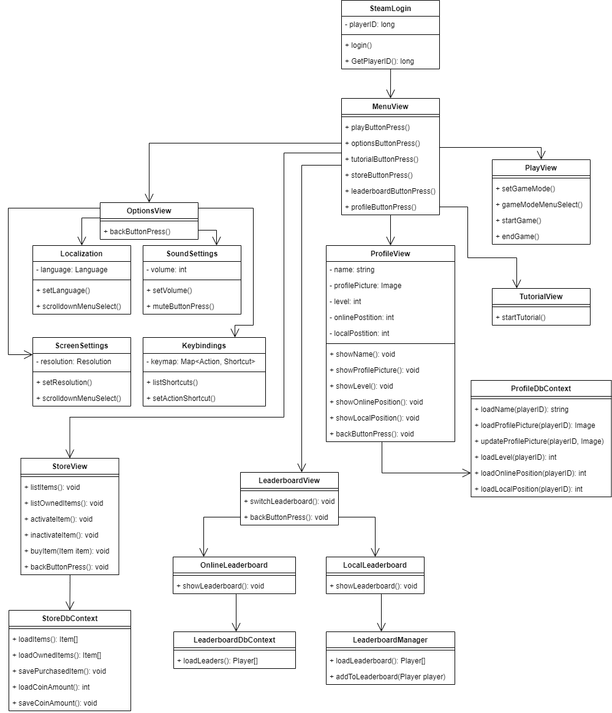
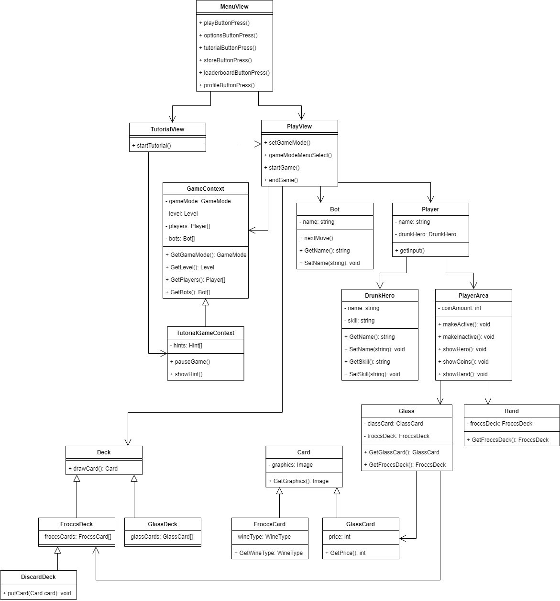
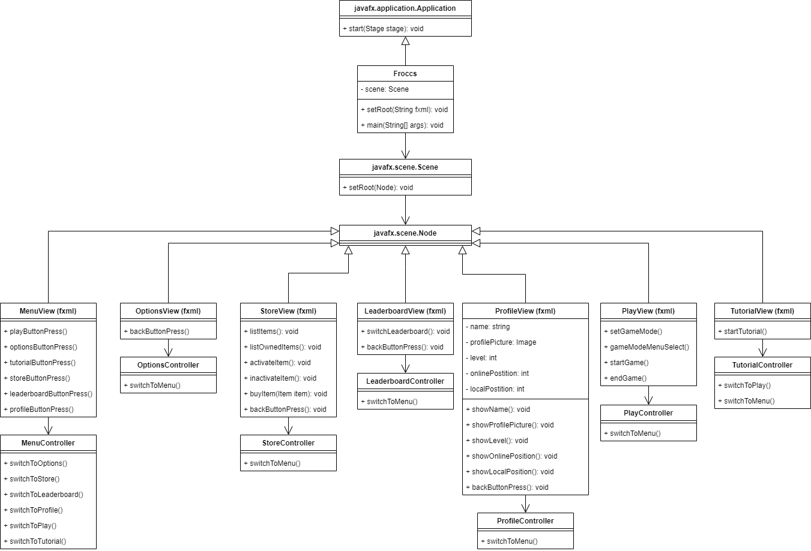
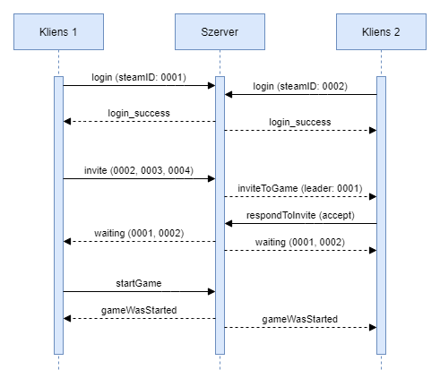
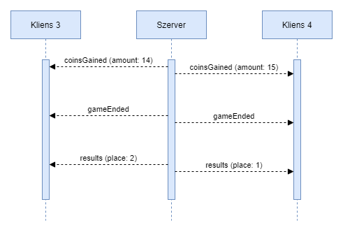
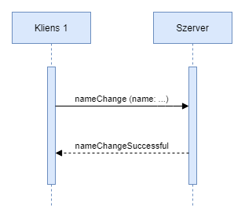

# Osztálydiagram

## Menü

### SteamLogin

A steambe való sikeres bejelentkezés után, a játékoshoz tartozó steam azonosító (másnéven steam ID) lekérdezéséért felelős osztály.

### MenuView

A főmenüből kiinduló almenük eléréséért felelős osztály. Menük kiválasztásával eljuthatunk a beállításokhoz, játékmenühöz, toturialhoz, áruházhoz, ranglistákhoz és a játékos profiljához.

### OptionsView

### Localization

### SoundSettings

### ScreenSettings

### KeyBindings

### StoreView

Az applikáción belüli áruház termékeinek kezeléséért felelős osztály. Mutatja az eladásra kínált tárgyakat és a játékos által birtokolt tárgyakat is, illetve kezeli azok megvételét.

### StoreDbContext

A játékosok által vásárolt, illetve a még nem birtokolt tárgyak adatainak tárolásáért felelős osztály. A játékos zsetonjainak számának illetve az újonnan vett tárgyainak elmentéséért felelős.

### ProfileView

A játékosokhoz tartozó profil menüben lévő adatok megjelenítéséért felelős osztály. Megjeleníti a játékos profilképét, nevét, helyezését a ranglistákon és játékos szintjét.

### LeaderBoardView

### OnlineLeaderBoard

### LeaderBoardContext

### LocalLeaderBoard

### LeaderBoardManager

### Playview

A ’játék’ almenü megjelenítése. Kiválasztható benne a játékmód, és elindítható segítségével a lobbi.

### TutorialView

A toturial elindítását megjelenítő almenüért felelős.

### ProfileDbContext

A játékoshoz tartozó profil adatainak tárolásáért és lekérdezéséért felelős osztály. Tárolt adatok: játékosnév, játékosazonosító, profilkép és a ranglistákon elért helyezés. A profilkép módosítása is ennek az osztálynak a segítségével történik.

## Játék

### MenuView

### Tutorialview

### PlayView

### GameContext

### Bot

A játékos ellen játszó, rendszer által vezérelt ellenféllel kapcsolatos adatokat kezeli. Többet között a bot nevét, illetve következő lépéseit.

### Player

A játékos meccs közbeni adatait tárolásáért és kezelésért felelős. Közvetlenül tartalmazza a játékos megjelenítendő nevét, illetve az általa választott drunkenherot.

### TutorialGameContext

A toturialban mutatott felugró játéktippekért ért segítségekért felelős.

### DrunkHero

### PlayerArea

A játékosok előtt lévő lapok, pontok, választott karakterét játék közben egy saját „területen” mutatja a játékfelület. A playerarea tárolja ennek a tartalmát, és kezeli, hogy éppen melyik játékosé aktív, ahogy haladunk a játékosok között a körben.

### Deck

### FroccsDeck

### DiscardDeck

### GlassDeck

### Glass

### Hand

### Card

### FroccsCard

### GlassCard

## JavaFX

### javafx.application.Application

Absztrakt osztály, a JavaFX környezet része. A JavaFX alkalmazást ebből az osztályból kell leszármaztatni. A start(Stage) metódust kötelező megvalósítani, hogy az alkalmazás futtatható legyen.

### Froccs

Az Application osztály leszármazottja. A JavaFX környezet az alkalmazás indításakor a következőképpen jár el:

1. Példányosítja az Applicationből leszármazó osztályt
2. Meghívja az init() metódust
3. Meghívja a start(Stage) metódust
4. Ha minden ablak bezárul, akkor meghívja a stop() metódust

A statikus scene adattag tartalmazza az éppen aktív nézetet, a Controller osztályok a nézetet a setRoot(String) metóduson keresztül módosíthatják (az adott elérésű fxml fájl kerül betöltésre).

### javafx.scene.Scene

Az aktuális nézetet tartalmazó osztály. Tartalmaz egy root Node-ot, amely a képernyőn látható elemek szülője. A root Node a setRoot(Node) metódus segítségével beállítható, ezzel tud az alkalmazásunk nézetet váltani.

### javafx.scene.Node

Az FXMLLoader a különböző nézeteket tartalmazó fxml fájlokat betölti a load() metódus segítségével és visszaad egy Node objektumot, amely a UI elemek szülője.

### MenuView (fxml)

Egy deklaratív fxml fájl, amely egy Node objektumnak felel meg. A főmenü UI elemeit tartalmazza hierarchikus formában.

### MenuController

A menüben történő események kezelőit tartalmazó osztály, az adott kezelőket az fxml-ben az elem (általában Button) onAction tulajdonságaként adjuk meg.

Az események a gombok a lenyomásai lehetnek:

- Kilépés
- Játék / tutorial indítása
- Beállítások megnyitása
- Profil megnyitása
- Rangsor megnyitása
- Áruház megnyitása

### OptionsView (fxml)

Egy deklaratív fxml fájl, amely egy Node objektumnak felel meg. A beállítások menüpont UI elemeit tartalmazza hierarchikus formában.

### OptionsController

A beállítások menüpontban történő események kezelőit tartalmazó osztály.

Kezeli a legördülő menük és a hangerő csúszka eseményeit, a kilépés gomb lenyomását.

### StoreView (fxml)

Egy deklaratív fxml fájl, amely egy Node objektumnak felel meg. Az áruház nézet UI elemeit tartalmazza hierarchikus formában.

### StoreController

Az áruház menüpontban történő események kezelőit tartalmazó osztály.

Lehetséges események:

- Kilépés
- Termék kiválasztása
- Termék megvásárlása

### LeaderboardView (fxml)

Egy deklaratív fxml fájl, amely egy Node objektumnak felel meg. A ranglista UI elemeit tartalmazza hierarchikus formában.

### LeaderboardController

A ranglista menüpontban történő események kezelőit tartalmazó osztály.

Lehetséges események:

- Kilépés
- Lokális / globális ranglista váltása

### ProfileView (fxml)

A ProfileView fxml fájl tartamaza a prorif menü UI elemeit hierarchikus formában.

### ProfileController

A profillal történő változások kezelőit tartalmazó osztály.

Lehetséges események:
- Szint változás
- Névváltozás
- Globális / Lokális helyezés változása
- Profil kép változás

### PlayView (fxml)

A PlayView fxml fájl tartalmazza a játéktér UI elemeit hierarchikus formában.

### PlayController

A PlayController a játék közbeni változásokat lekezelő osztály.

Lehetséges események:
- laphúzása
- Coin növekedése / csökenése
- pohárral történő változások

### TutorialView (fxml)

A TutorialView fxml fájl tartalmazza a tudoriul UI elemeit hierarchikus formában.

### TutorialController

A TutorialController a tutorial elvégzése közben fellépő változásokat lekezelő osztály.

Lehetséges események:
- A tutorial elkezdése / befejezése
- A tutorial következő lépése

Usecase 1:
==========

Meghívok három barátot és elindítunk egy játékot.

## Játékosok:

	Client 1:
		steamID: "0001"
	-> hívó

	Client 2:
		steamID: "0002"

	Client 3:
		steamID: "0001"

	Client 4:
		steamID: "0001"
	-> hívottak

## Bejelentkezés:

A websocket kapcsolat a kliens indításakor létrejön, ezen keresztül kommunikál a szerverrel, az üzenet JSON formátumban van elküldve, a type tag tartalmazza az üzenet típusát.

	Client 1:
		{ "type": "login", "steamID": "0001" } -> Server

	Client 2 - 4:
		{ "type": "login", "steamID": "..." } -> Server

A login típusú üzenetet a kliens a Steam-re való bejelentkezés után küldi, a steamID a Steam-től kapott token.

	Server:
		Map<Session, PlayerInfo>
		Session@0x0001 -> PlayerInfo [ steamID: "0001" ]
		Session@0x0002 -> PlayerInfo [ steamID: "0002" ]
		Session@0x0003 -> PlayerInfo [ steamID: "0003" ]
		Session@0x0004 -> PlayerInfo [ steamID: "0004" ]

A szerver minden websocket kapcsolathoz rendel egy PlayerInfo objektumot, amely a csatlakozott játékos adatait tárolja.

## Meghívás:

	Client 1:
		{ "type": "invite", "players": [ "0002", "0003", "0004" ] } -> Server
		
A leader játékos a barátai közül választ játékosokat, akiket meghív. A meghívást az invite típusú üzenetben elküldi a szervernek.

	Server:
		Set<Game>
		Game [ status: GameStatus.Inactive, leader: "0001", players: [ "0001", "0002", "0003", "0004" ], accepted: [] ]

A szerver meghíváskor létrehoz egy Game objektumot, ahol az adott játék adatait tárolja.

		{ "type": "inviteToGame", "leader": "0001" } -> Client 2
		{ "type": "inviteToGame", "leader": "0001" } -> Client 3
		{ "type": "inviteToGame", "leader": "0001" } -> Client 4

Minden meghívott játékosnak küld egy inviteToGame üzenetet. Az üzenetet akkor tudja elküldeni, ha a játékos be van jelentkezve, ezt a PlayerInfo objektumokból tudja meghatározni. Ha megtalálja az adott játékost, akkor a hozzá tartozó Session objektumon keresztül elküldi az üzenetet.

## Meghívás elfogadása:

	Client 2-4:
		{ "type": "respondToInvite", "response": "accept" } -> Server

A meghívott játékosok respondToInvite üzenetben tudják elfogadni vagy elutasítani a meghívást.

	Server:
		{ "type": "waiting", "players": [...] } -> Minden várakozó Client, a Server az accepted-ből tudja + a leader

A leader és a meghívást elfogadó játékosok egy töltőképernyőre kerülnek, ahol láthatják, hogy ki fogadta el a meghívást, ezért a szerver minden elfogadáskor elküldi az aktuálisan várakozó játékosok azonosítóját.

## Meghívás elutasítása:

	Client 2-4:
		{ "type": "respondToInvite", "response": "reject" } -> Server

## Válaszok összesítése:

	Server:
		Game [ status: GameStatus.Inactive, leader: "0001", players: [ "0001", "0002", "0003", "0004" ], accepted: [ "0002", ... ] ]

Ha egy játékos elfogadja a meghívást, akkor a Game objektumban az azonosítója eltárolásra kerül az accepted listában.

## Játék indítása:

Client 1 indíthatja a játékot, ha elegendő játékos (1 db) elfogadja a meghívást.

	Client 1:
		{ "type": "startGame" } -> Server

A szerver a meghívott játékosoknak elküldi egy gameWasStarted üzentben, hogy a játék elindult.

	Server:
		{ "type": "gameWasStarted" } -> Client 2-4

Usecase 2:
==========

A húzópakli elfogy és a játék véget ér, a pontok összeszámolása és a játékosok kiléptetése.

## Húzópakli ellenőrzése:

	Server:
		FroccsDeck [ froccsCards ]

A froccsCards a lapokat tároló lista, ha nincs benne elem, akkor a lapok elfogytak és a játék véget ér.

		deck.getFroccsCards().length == 0

## Pontok összeszámolása:

	Game [ status: GameStatus.Active, leader: "0001",
		players: [ "0001", "0002", "0003", "0004" ], accepted: [],
		coins: [ "0001" -> 12, "0002" -> 13, "0003" -> 14, "0004" -> 15 ] ]

A coins mező típusa Map<String, int> és az adott játékos coin mennyiségét tárolja. A játék során a szerver folyamatosan frissíti a mennyiséget, amikor egy játékos elad egy fröccsöt. A játék végén ez alapján határozza meg a helyezéseket. Az 1. és 2. helyezett a szerzett pontokat megkapja és elköltheti az áruházban. Ha holtverseny alakul ki, akkor csak az 1. helyezettek kapnak pontot.

	Game game
	GameDbContext gameDb

	gameDb.addCoinAmount("0004", game.getCoins().get("0004"));
	gameDb.addCoinAmount("0003", game.getCoins().get("0003"));

A nyertes játékosokat úgy határozza meg a szerver, hogy a coins alapján sorbaállítja a játékosokat. Jelen esetben a 0003 és 0004 azonosítójú játékosok kapnak pontot.

	Server:
		{ "type": "coinsGained", "amount": 14, "total": ... } -> Client 3
		{ "type": "coinsGained", "amount": 15, "total": ... } -> Client 4

A játék végén a játékosok láthatják, hogy hány coin-t szereztek és ezzel mennyi van összesen.

## Játék befejezése:

Ha a szerver eltárolta a gyűjtött pontokat, akkor befejezi a játékot. A szerver a játékosoknak elküldi egy gameEnded üzentben, hogy a játék véget ért.

	Server:
		{ "type": "gameEnded" } -> Client 1-4

A szerver elküldi a helyezéseket is, hogy a kliens megjeleníthesse az endscreen-t.

	Server:
		{ "type": "results", "place": 1 } -> Client 4
		{ "type": "results", "place": 2 } -> Client 3
		...

Usecase 3:
==========

A Profil menüben megváltoztatni a játékosnevet.

## Játékosnév megváltoztatása:

Az alkalmazás tartalmaz egy playerName nevű mezőt, a beírt szöveg a getPlayerName() metódussal lekérdezhető a beírt játékosnév.

	public class Froccs extends Application {

		private static TextField playerName;

		public void start(Stage s) {
			ProfileDbContext profileDb = new ProfileDbContext();
			playerName = new TextField(profileDb.loadName());
			...
		}

		...

		static String getPlayerName() {
			return playerName.getText();
		}
	
	}

A Profil menü kezelője a ProfileController osztály lesz, ennek a saveChanges() metódusa kerül meghívásra a Mentés gomb megnyomásakor.

	public class MenuController {
		@FXML
		protected void saveChanges() {
			ProfileDbContext profileDb = new ProfileDbContext();
			profileDb.changeName(Froccs.getPlayerName());
		}
	}

A ProfileDbContext changeName() metódusa a websocket kapcsolaton keresztül üzenetet küld a szervernek a névváltozásról.

	{ "type": "nameChange", "name": ... } -> Server

