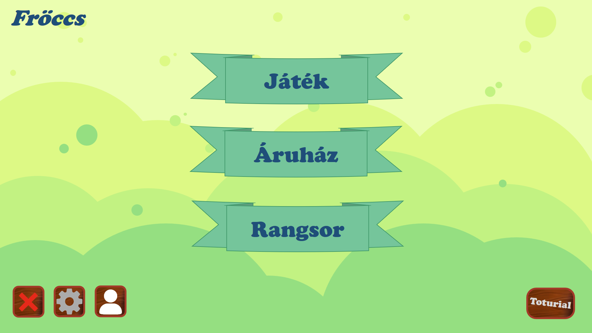
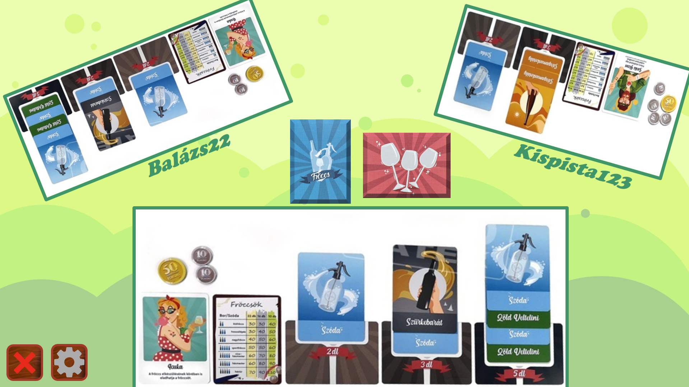
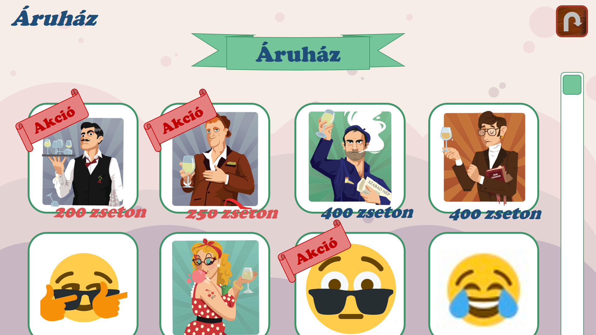
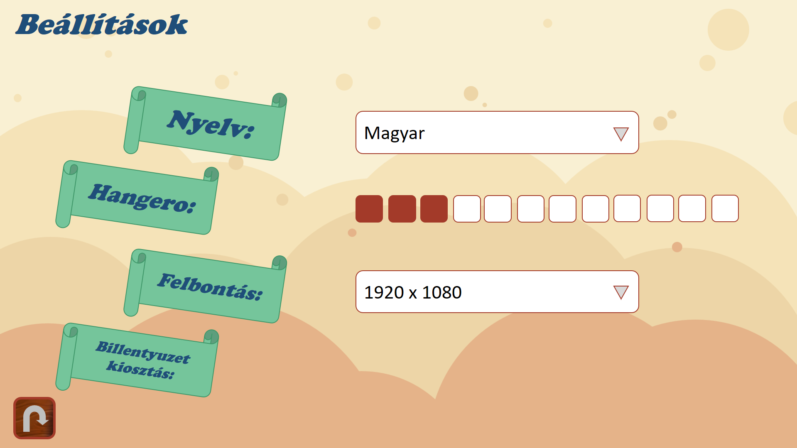

# Felhasználói felület

## Menü

## Játékablak

## Profil

## Rangsor

## Áruház

## Beállítások

# Adatbázis

## Szemantikai adatmodell

## Relációs adatmodell

	Termék
	======
	TermékID INT
	Név      VARCHAR
	Ár       INT
	Akció    FLOAT

	Játékos
	=======
	SteamID    VARCHAR
	Játékosnév VARCHAR
	Profilkép  INT - fájl azonosítója
	Coin       INT
	Helyezés   INT
	Szint      INT

	Tárgyak
	=======
	SteamID  INT
	TermékID INT

## Osztályok

### StoreDbContext

A játékosok által vásárolt, illetve a még nem birtokolt tárgyak adatainak tárolásáért felelős osztály. A játékos zsetonjainak számának illetve az újonnan vett tárgyainak elmentéséért felelős.

### ProfileDbContext

A játékoshoz tartozó profil adatainak tárolásáért és lekérdezéséért felelős osztály. Tárolt adatok: játékosnév, játékosazonosító, profilkép és a ranglistákon elért helyezés. A profilkép módosítása is ennek az osztálynak a segítségével történik.
